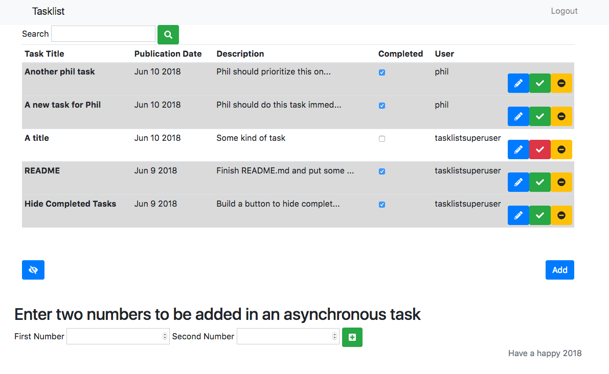

# Tasklist
A Tasklist app in Django

SETUP

To run this project, you will need Postgres. I recommend downloading the Postgres app. It is assumed you have pip installed.

In the Postgres app, open the terminal

Type 'CREATE USER name;' with name being the username you want to create. The terminal should respond 'CREATE ROLE'

Type 'CREATE DATABASE dbname OWNER name;' substituting dbname and name with your preferred database name and the username you chose earlier

On a Mac, open a new terminal tab

Type 'mkdir Tasklist' to create a directory called 'Tasklist'

It is recommended you use a virtual environment. If you do not have virtualenv installed please type 'pip install virtualenv'

Create a virtualenv by typing 'virtualenv myvenv'

Activate the virtualenv by typing 'source myvenv/bin/activate'

Install django to myvenv by typing 'pip install django'

Install celery with 'pip install celery'

Now clone the project with 'git clone https://github.com/DavTho1983/Tasklist.git'

Enter the project by typing 'cd Tasklist'

List the available files with 'ls' - you should see a file called 'manage.py'

Install psycopg2 with 'pip install psycopg2'

Navigate to the settings.py file at 'Tasklist/Tasklist/settings.py'. It should currently look like this:

DATABASES = {
    'default': {
        'ENGINE': 'django.db.backends.postgresql',
        'NAME': 'tasklistdb',
        'USER': 'tasklistuser',
        'PASSWORD': '',
        'HOST': 'localhost',
        'PORT': '5434',
    }
}

Change this part so the DATABASES field uses the username, password and ports you created earlier in the Postgres App. It is usual to use port 5432, but in my development environment I used 5434.

Now in the terminal type:

'python manage.py makemigrations'

'python manage.py migrate'

Create a superuser for the database by typing:

'python manage.py createsuperuser' and complete the username, email and password

Now you can run the server with the command 'python manage.py runserver'

Open your browser at http://127.0.0.1:8000/ to view the project running
